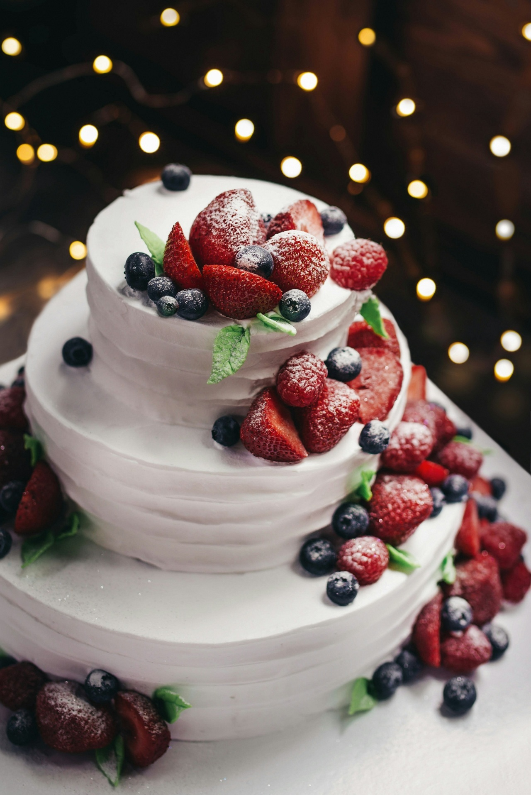
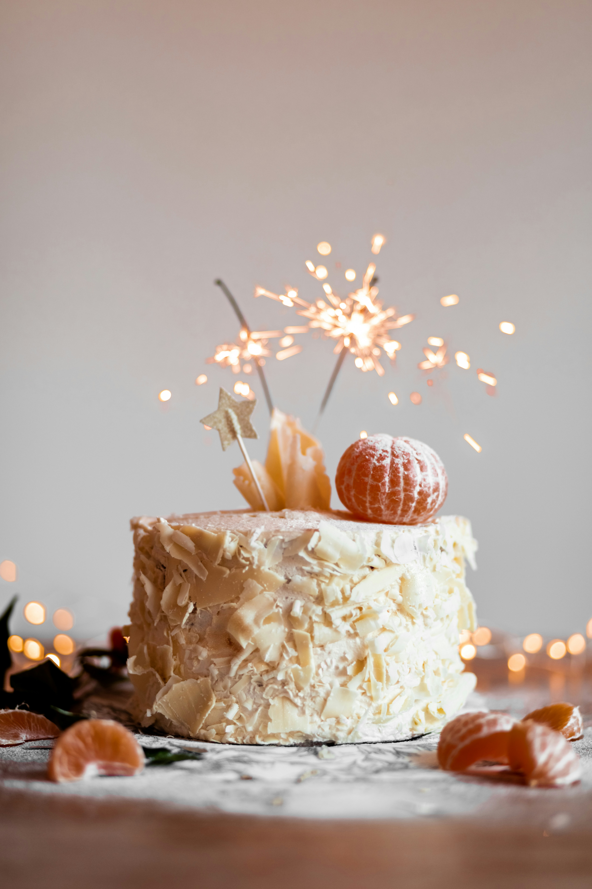
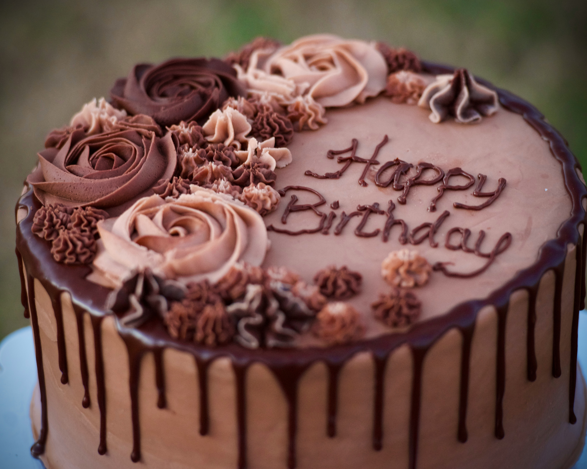

<html lang="en">
<head>
<meta charset="UTF-8">
<meta name="viewport" content="width=device-width, initial-scale=1.0">
<title>Ananya Cake Shopee</title>

</head>

<body>

<header>
<h1>🎂 Ananya Cake Shopee</h1>

Freshly Baked Cakes for Every Celebration

</header>

<section>

<h2>Our Cake Flavours</h2>

🍰 Delicious Cake

🍮 Butterscotch Cake

🍓 Strawberry Cake

🍫 Chocolate Cake

🍍 Pineapple Cake

🥭 Mango Cake

🍒 Black Forest

🍦 Vanilla Cake

❤️ Red Velvet

🍫 Choco Truffle

</section>

<section>

<h2>Why Choose Us?</h2>

✅ Fresh Ingredients

🎂 Custom Cakes

💝 Birthday Cakes

💍 Wedding Cakes

🚚 Fast Delivery

😊 Affordable Price

</section>

<section>

<h2>Contact Us</h2>

📞 <b>9284485735</b>

📍 Sai Mandir Samor, 
Main Road, Unchagaon, 
Kolhapur, Maharashtra

<a class="btn" href="https://wa.me/919284485735">
Order on WhatsApp
</a>

</section>

<footer>

© 2026 Ananya Cake Shopee | Made with ❤️

</footer>

</body>
</html>
